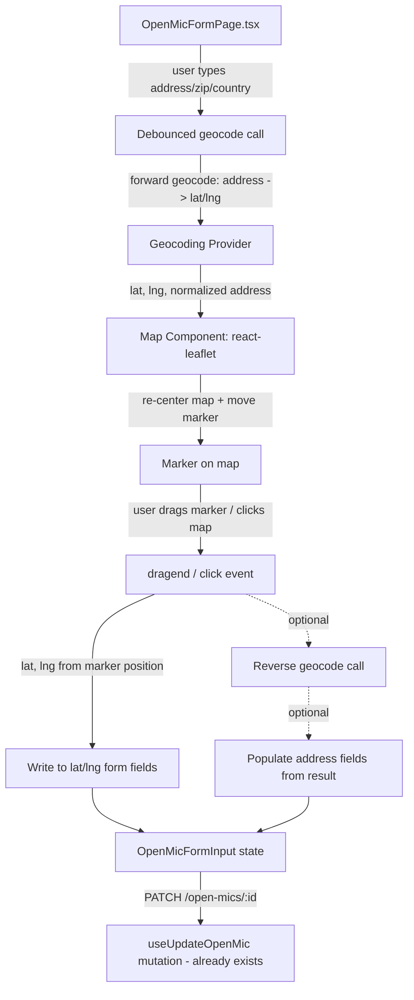

# Displaying a Location-Picker Map on the Open Mic Edit Screen

## Executive Summary

The `openmics.org` frontend is a React + TypeScript + Vite SPA[^1] with no map library and no dedicated map/geocoding endpoint currently wired up — the OpenMic edit form (`OpenMicFormPage.tsx`, reached today only via `/dashboard/series/:id/edit`) is a plain `useState`-per-field form[^2] that already collects `address_line1`, `address_line2`, `postcode`, `city`, `country`, `lat`, and `lng` as part of `OpenMicFormInput`[^3], and an update mutation (`useUpdateOpenMic`) already exists and PATCHes `/open-mics/:id`[^4]. The backend data model stores `lat`/`lng` as nullable `numeric(9,6)` columns and derives a PostGIS `geography(Point,4326)` column for map/near-me queries[^5], and the OpenAPI contract already validates `lat`/`lng` bounds (`-90..90`/`-180..180`)[^6] — but there is **no documented geocoding endpoint or provider** anywhere in the docs; a single unexplained reference to a "geocoding validation workflow" exists in the data model doc with no further specification[^7]. Product requirements contain no explicit mention of maps or geocoding, and public map discovery is explicitly deferred to Phase 3 and stripped from the current API contract[^8]. This is therefore a **frontend-only, client-side integration**: the recommended approach is Leaflet + react-leaflet for the map/marker widget, paired with a third-party geocoding provider (LocationIQ or OpenCage recommended over public Nominatim or a mandatory-billing Google Cloud setup) to convert address fields to/from lat/lng, wired into the existing form via debounced address→map sync and marker-drag→lat/lng sync.

## Confidence Assessment

**Certain (directly verified in repo):**
- Frontend stack (React 19 + TS + Vite, Tailwind, TanStack Query), existing `OpenMicFormPage.tsx` form pattern, existing `OpenMicFormInput`/`useUpdateOpenMic` data plumbing, existing DB/API schema for address and lat/lng fields, absence of any map library or geocoding endpoint in the codebase.
- External map/geocoding library capabilities, pricing tiers, and ToS constraints — all backed by official documentation URLs cited below.

**Inferred / needs your confirmation:**
- The "geocoding validation workflow" mentioned once in `docs/architecture/data-model.md:266` is **undefined** anywhere in the docs — it's unclear whether this implies a *backend* geocoding/validation service is planned, or whether validation is meant to happen client-side (as this research assumes). **This should be resolved with the team before implementation**, since it affects whether geocoding calls happen from the frontend directly to a third-party provider (this report's assumption) or via a backend proxy endpoint.
- Whether the edit screen should live at the existing `/dashboard/series/:id/edit` route (current pattern) or a new public `/open-mics/:id/edit` route — the frontend architecture doc's canonical route map names the latter, but it isn't implemented; the dashboard route is what's real and wired today.
- react-hook-form + zod are installed as dependencies but **used nowhere in the codebase** — introducing a map picker is a natural opportunity to also decide whether to adopt them for this form (matching the architecture doc's stated convention) or keep the existing manual-`useState` style used by all current forms, for consistency. This is a project convention decision, not a map-specific one.
- Exact current pricing/quota figures for Google Maps, Geoapify, and Geocode Earth could not be fully verified (JS-rendered pricing pages) — verify directly before committing to a paid vendor.

---

## 1. Current State in the Repository

### 1.1 Frontend stack & existing edit form

- **Stack:** React 19 + TypeScript (strict) + Vite build; TanStack Query for server state; Tailwind + Radix UI for styling/primitives; react-hook-form + zod declared as dependencies but not yet used anywhere[^1][^9].
- **Existing OpenMic edit form:** `apps/web/src/views/OpenMicFormPage.tsx` — used for both create (`/dashboard/series/new`) and edit (`/dashboard/series/:id/edit`), driven by `useState` per field (`name`, `venueName`, etc.) with manual `dirty`/`touched` flags and server-side error mapping via `openMicErrorMessage()`[^2]. No `/open-mics/:id/edit` route exists; only the dashboard path is wired[^10].
- **Data plumbing already in place** (`apps/web/src/features/organizer.ts`):
  - `OpenMicFormInput` type already includes `address_line1`, `address_line2?`, `postcode?`, `city`, `country`, `lat?`, `lng?`[^3].
  - `useUpdateOpenMic(openMicId)` already PATCHes `/open-mics/:id`, updates the TanStack Query cache, and invalidates the owner's list on success[^4].
  - `useOpenMicDetail(id)` GETs the full `OpenMicDetail` (organizer-only shape including lat/lng) for populating the edit form[^11].
- **Public detail view** (`DetailPage.tsx`) currently renders only `venue_name` + `city` next to a `MapPin` icon — no address, lat, or lng is displayed anywhere today[^12].

**Implication:** No backend/API work is required to support a map picker — the fields already exist end-to-end. This is purely a frontend addition to `OpenMicFormPage.tsx` (or its successor).

### 1.2 Data model & API contract for location fields

| Field | Type | Nullability | Source |
|---|---|---|---|
| `address_line1` | string | required | `openapi.yaml:1983`, `data-model.md:192` |
| `address_line2` | string | optional | `openapi.yaml:1985`, `data-model.md:192` |
| `postcode` | string | optional | `openapi.yaml:1987`, `data-model.md:193` |
| `city` | string | required | `openapi.yaml:1989`, `data-model.md:193` |
| `country` | string | required | `openapi.yaml:1991`, `data-model.md:193` |
| `lat` | number, -90..90 | optional (paired with `lng`) | `openapi.yaml:1993-1996`, `data-model.md:194` |
| `lng` | number, -180..180 | optional (paired with `lat`) | `openapi.yaml:1997-2000`, `data-model.md:194` |

- No `state`/region field exists on `OpenMics` or `Events` — only `address_line1/2`, `postcode`, `city`, `country`[^5][^13].
- DB check constraint on `Events`: `CHECK ((lat IS NULL) = (lng IS NULL))` — lat/lng must both be set or both null[^14].
- The one mention of "geocoding" in all documentation: *"supplied coordinates must pass latitude/longitude bounds checks and the geocoding validation workflow"* (`data-model.md:266`) — **not defined anywhere else**[^7]. Flag this to the team before deciding whether geocoding validation happens client-side or via a (currently nonexistent) backend endpoint.
- `docs/decisions.md:52` and `docs/architecture/api-design.md` confirm **public map discovery (`/open-mics/map`, `MapResult`/`MapPin`/`MapCluster` schemas) is deferred to Phase 3** and removed from the current `openapi.yaml` contract[^8]. This is about the public *directory* map, not the edit-screen location picker — the two are unrelated features, but worth noting since "map" in this codebase's docs otherwise refers to that deferred feature.
- `docs/3-open-mic-requirements.md` contains no requirements text about maps, geolocation, or geocoding for venue creation/edit[^15].

---

## 2. Architecture Overview

**Key design point:** the sync is bidirectional but the *authoritative* value driving the "Save" PATCH request is always `lat`/`lng` plus the text address fields, all already part of `OpenMicFormInput`[^3] — the map is purely a UI convenience layered on top of existing form state, not a new data path.

---

## 3. Map Library Options

| Option | API key required | Free tier | License | Best fit |
|---|---|---|---|---|
| **Leaflet + react-leaflet + OSM tiles** | No | Yes (self-managed tile load) | MIT/BSD | ✅ Recommended — no billing setup, smallest footprint |
| **MapLibre GL JS + MapTiler/Protomaps** | Only for hosted tiles | MapTiler free tier (limited/non-commercial) or free self-hosted Protomaps | BSD-3 | Good if vector-tile rendering quality matters more than setup simplicity |
| **Google Maps JS + Places + Geocoding** | Yes, **billing account mandatory** | $300 trial credit for new accounts, then pay-per-call | Google Maps Platform TOS | Best autocomplete UX, but forces Google Cloud billing setup |
| **Mapbox GL JS + Mapbox Geocoding** | Yes (token), free tier without forced card | Free tier exists | Proprietary TOS since 2020 + telemetry | Good vector rendering, avoid if project needs to stay open-source pure |
| **OpenLayers / static map images** | No (OpenLayers) | Yes | BSD-2 | More power than needed for one draggable pin; static images aren't interactive enough for this use case |

### 3.1 Leaflet + react-leaflet + OpenStreetMap (recommended)

- Packages: `leaflet`, `react-leaflet`[^16]. No API key for the map itself.
- OSM's standard raster tile server is free but **not licensed for high-volume production traffic** per the OSM Tile Usage Policy — requires a valid User-Agent, caching, and low/moderate traffic; heavy production use should self-host tiles or use a paid tile provider[^17].
- Marker supports `draggable: true` and a documented `dragend` event out of the box[^18].
- `react-leaflet`'s official "Draggable Marker" example is the canonical React pattern to copy: a `<Marker draggable eventHandlers={{dragend: ...}}>` using a ref and memoized handlers[^19].

### 3.2 MapLibre GL JS

- `maplibre-gl` (BSD-3-Clause fork of pre-license-change Mapbox GL JS)[^20]; needs a tile source such as MapTiler Cloud (API key, free tier limited to testing/non-commercial, then $30/mo+)[^21] or self-hosted Protomaps (free, you host the PMTiles yourself)[^22].
- Marker API mirrors Mapbox GL JS's (`new maplibregl.Marker({draggable:true})`, `dragend` event)[^23].

### 3.3 Google Maps JS + Places Autocomplete + Geocoding

- Recommended wrapper: `@vis.gl/react-google-maps` (supersedes the unmaintained `@react-google-maps/api`)[^24].
- **Requires a Google Cloud project with billing enabled**, even to use free credits; the historical $200/month geocoding credit programme ended Feb 28, 2025, replaced by a $300 trial credit for new accounts, then per-call pricing[^25]. Geocoding API is capped at 3,000 queries/minute[^25].
- New `PlaceAutocompleteElement` is the modern Places Autocomplete widget; note an EEA-specific restriction on using the Autocomplete widget together with a map unless billing address is outside the EEA[^26].
- Official "Places Autocomplete + Address Form" sample is the canonical reference implementation for populating address fields from a selected place[^27].

### 3.4 Mapbox GL JS

- `mapbox-gl` + `@mapbox/mapbox-gl-geocoder`[^28]. Free tier exists without forcing a billing card, but the package is under Mapbox's proprietary TOS since Dec 2020 (not open-source) and includes usage telemetry[^28]. A Commercial Application License may be required for certain business categories (e.g., real estate, BI) regardless of volume[^29]. Official "Create a draggable point" example covers the drag-marker pattern directly[^30].

---

## 4. Geocoding Provider Options

Since Nominatim's public endpoint **explicitly forbids autocomplete-while-typing** and caps requests at 1/second[^31], and Google forces a mandatory billing-account setup[^25], the most practical providers for this project are:

| Provider | Free tier | Commercial use OK? | Fwd + Rev geocoding | Notes |
|---|---|---|---|---|
| **LocationIQ** | 5,000 req/day, 2 req/s, no card required | Yes, with attribution link | Both | Highest free-tier volume; good default choice[^32] |
| **OpenCage** | 2,500 req/day, **trial only, not for ongoing production use** | Paid tiers from €45/mo or pay-as-you-go packs from €20/10k requests | Both | Explicitly permits **permanent storage** of results (unusual, most providers restrict this); actively funds Nominatim/libpostal/OpenAddresses — best "open-source aligned" choice[^33] |
| **Geoapify** | Credit-based free plan (exact quota unverified — JS-rendered pricing page) | Yes, with attribution | Both + autocomplete | Free plan usage overage is "soft" (warning before block)[^34] |
| **Photon** (public demo) | Unlimited but unquantified "fair use," no SLA, can be throttled/banned without notice | Unclear | Both, plus autocomplete | Self-hostable (Docker, ~95GB disk/64GB+ RAM for full planet; lighter for a country extract)[^35] |
| **Self-hosted Nominatim** | N/A (infra cost only) | Yes | Both | Full planet needs 128GB+ RAM, 1TB disk, 2.5–5 day import — only reasonable if scoped to a single country extract[^36] |
| **Pelias (self-hosted)** | N/A | Yes | Both + autocomplete | More complex than Nominatim; 8GB+ RAM minimum, Linux/macOS only[^37] |

**Recommendation:** Start with **LocationIQ's free tier** (no card required, highest daily volume, permits commercial use with attribution) for both forward geocoding (address → lat/lng, on debounced text input) and reverse geocoding (marker drag → address, optional). Revisit OpenCage if permanent caching/storage of results becomes important, since its ToS explicitly allows this while most competitors restrict it.

---

## 5. Two-Way Sync Implementation Pattern

### 5.1 Address fields → map (forward geocoding)

1. Debounce address/zip/country field changes (~300–500ms) using a hook such as `use-debounce`'s `useDebouncedCallback`[^38].
2. On debounce settle, call the geocoding provider's forward endpoint (e.g., LocationIQ `/v1/search`, or via a provider-agnostic wrapper like `leaflet-geosearch`, which normalizes results from OSM/Google/Bing/Esri/LocationIQ/OpenCage into `{x: lon, y: lat, label, bounds}`)[^39].
3. On success: `map.setView([lat, lng])` and move the marker; on failure/ambiguous result, show a "location not found — drag the pin to set it manually" state rather than guessing[^40].

### 5.2 Map marker → lat/lng fields (and optional reverse geocoding)

1. Set the Leaflet marker `draggable: true`; use `react-leaflet`'s documented `dragend` event handler pattern to read `marker.getLatLng()`[^19].
2. Write `lat`/`lng` directly into `OpenMicFormInput` state on every `dragend` — this requires **no API call** and has no rate-limit exposure.
3. Optionally, also call the provider's reverse-geocoding endpoint on `dragend` to refresh the address text fields (e.g., LocationIQ/Nominatim `/reverse`), with a "use this address?" confirmation step since reverse geocoding is probabilistic and may not match a specific street address exactly[^41].
4. Also support a plain map `click` (not just marker drag) to drop the pin at a new location, using the same handler.

### 5.3 Accessibility

- Native map libraries do **not** support full keyboard-driven marker dragging out of the box[^42]. Always keep visible/keyboard-accessible numeric `lat`/`longitude` `<input type="number">` fields alongside the map as the authoritative, fully keyboard-operable fallback — the map/drag/autocomplete flows are progressive enhancements that populate the same fields[^42].
- If building a custom address-suggestion dropdown (rather than using a vendor widget), follow the WAI-ARIA APG Combobox Pattern (`role="combobox"`, `aria-expanded`, `aria-activedescendant`, listbox popup, keyboard interaction)[^43].
- Use real `<label>`s for all fields including lat/lng (off-screen text rather than `display:none`), and group "Address" vs. "Map location" fields with `<fieldset>`/`<legend>`[^44].

---

## 6. Key Repositories / Files Summary

| Location | Role |
|---|---|
| `apps/web/src/views/OpenMicFormPage.tsx` | Existing create/edit form — where the map component would be added |
| `apps/web/src/features/organizer.ts` | `OpenMicFormInput` type, `useUpdateOpenMic`/`useOpenMicDetail` hooks — already support lat/lng, no changes needed |
| `apps/web/src/App.tsx` | Route table — confirms edit form is reached via `/dashboard/series/:id/edit`, no `/open-mics/:id/edit` route exists |
| `docs/architecture/data-model.md:184-266` | `OpenMics`/`Events` schema incl. `lat`/`lng`/`location` PostGIS column and the undefined "geocoding validation workflow" reference |
| `openapi.yaml:1965-2070` | `OpenMicCreateRequest`/`OpenMicUpdateRequest`/`OpenMic` schemas with `lat`/`lng` bounds validation |
| `docs/architecture/api-design.md` | Confirms public map/geo discovery is deferred to Phase 3 (unrelated to this edit-screen feature) |

---

## Footnotes

[^1]: apps/web/src/App.tsx; docs/5-open-mic-frontend-architecture.md; apps/web/package.json — React 19 + TypeScript + Vite stack, TanStack Query, Tailwind + Radix UI.
[^2]: apps/web/src/views/OpenMicFormPage.tsx:1-60 — manual useState-per-field pattern with `openMicErrorMessage()` server-error mapping.
[^3]: apps/web/src/features/organizer.ts:25-50 — `OpenMicFormInput` type definition.
[^4]: apps/web/src/features/organizer.ts:88-99 — `useUpdateOpenMic` mutation, PATCH `/open-mics/:id`.
[^5]: docs/architecture/data-model.md:184-227 — `OpenMics` entity: `lat numeric(9,6)`, `lng numeric(9,6)`, generated `location geography(Point,4326)` column, GIST index.
[^6]: openapi.yaml:1993-2000 — `lat`/`lng` bounds validation on `OpenMicCreateRequest`.
[^7]: docs/architecture/data-model.md:266 — sole mention of "the geocoding validation workflow," undefined elsewhere.
[^8]: docs/decisions.md:52; docs/architecture/api-design.md ("Public map/geo discovery" deferred-surface entry) — public map discovery deferred to Phase 3, removed from Phase 1 contract.
[^9]: apps/web/package.json:25,27 — `react-hook-form`, `zod` listed as dependencies; grep across apps/web/src found zero usages of either.
[^10]: apps/web/src/App.tsx:22-53 — full route table; no `/open-mics/:id/edit` route; edit reached via `/dashboard/series/:id/edit` (`seriesEditMatch`).
[^11]: apps/web/src/features/organizer.ts:68-75 — `useOpenMicDetail(id)`.
[^12]: apps/web/src/views/DetailPage.tsx:62 — only `venue_name`/`city` rendered next to a `MapPin` icon; no address_line1/2, postcode, country, lat, or lng displayed.
[^13]: docs/architecture/data-model.md:241-263 — `Events` entity mirrors the same address/lat/lng fields as `OpenMics`.
[^14]: docs/architecture/data-model.md:261 — `CHECK ((lat IS NULL) = (lng IS NULL))` on `Events`.
[^15]: docs/3-open-mic-requirements.md — full-document search found no map/geolocation/geocoding requirements text; only generic "venue" mentions at lines 67, 75, 126, 131.
[^16]: [Leaflet](https://leafletjs.com/) documentation; [react-leaflet npm package](https://www.npmjs.com/package/react-leaflet).
[^17]: [OSM Tile Usage Policy](https://operations.osmfoundation.org/policies/tiles/).
[^18]: [Leaflet Marker API reference — drag events](https://leafletjs.com/reference.html#marker-event).
[^19]: [React-Leaflet "Draggable Marker" official example](https://react-leaflet.js.org/docs/example-draggable-marker/).
[^20]: [maplibre-gl npm package](https://www.npmjs.com/package/maplibre-gl); [MapLibre GL JS docs](https://maplibre.org/maplibre-gl-js/docs/).
[^21]: [MapTiler Cloud pricing](https://www.maptiler.com/cloud/pricing/).
[^22]: [Protomaps](https://protomaps.com/).
[^23]: [MapLibre GL JS Marker class API](https://maplibre.org/maplibre-gl-js/docs/API/classes/Marker/).
[^24]: [@vis.gl/react-google-maps](https://visgl.github.io/react-google-maps/).
[^25]: [Google Maps Geocoding API usage and billing](https://developers.google.com/maps/documentation/geocoding/usage-and-billing); [Google Maps Platform pricing](https://mapsplatform.google.com/pricing/).
[^26]: [Google Places Autocomplete (new) documentation](https://developers.google.com/maps/documentation/javascript/place-autocomplete-new).
[^27]: [Google Places Autocomplete + Address Form official sample](https://developers.google.com/maps/documentation/javascript/examples/places-autocomplete-addressform).
[^28]: [mapbox-gl npm package](https://www.npmjs.com/package/mapbox-gl).
[^29]: [Mapbox pricing / Commercial Application License terms](https://www.mapbox.com/pricing).
[^30]: [Mapbox "Create a draggable point" official example](https://docs.mapbox.com/mapbox-gl-js/example/drag-a-point/).
[^31]: [Nominatim Usage Policy](https://operations.osmfoundation.org/policies/nominatim/) — 1 req/sec cap, autocomplete listed as "Unacceptable Use."
[^32]: [LocationIQ pricing](https://locationiq.com/pricing) — 5,000 req/day free tier, no card required, commercial use permitted with attribution.
[^33]: [OpenCage pricing](https://opencagedata.com/pricing.md); [OpenCage API/rate limits](https://opencagedata.com/api.md); [OpenCage about page](https://opencagedata.com/about) — 2,500 req/day trial-only free tier; explicit permanent-storage permission; funds Nominatim/libpostal/OpenAddresses.
[^34]: [Geoapify pricing](https://www.geoapify.com/pricing/); [Geoapify Geocoding API](https://www.geoapify.com/geocoding-api/).
[^35]: [Photon demo ToS](https://photon.komoot.io/); [Photon GitHub README](https://github.com/komoot/photon) — ~95GB disk, 64GB+ RAM recommended for full planet.
[^36]: [Nominatim Docker (mediagis)](https://github.com/mediagis/nominatim-docker); [Nominatim Installation docs](https://nominatim.org/release-docs/latest/admin/Installation/) — 128GB+ RAM, 1TB disk, 2.5–5 day import for full planet.
[^37]: [Pelias](https://pelias.io/); [pelias/docker](https://github.com/pelias/docker) — 8GB+ RAM minimum, Linux/macOS only.
[^38]: [use-debounce repository](https://github.com/xnimorz/use-debounce).
[^39]: [leaflet-geosearch repository](https://github.com/smeijer/leaflet-geosearch).
[^40]: [Nominatim Reverse API docs](https://nominatim.org/release-docs/latest/api/Reverse/) — reverse geocoding returns exactly one result or an error for unmapped areas.
[^41]: [react-geocode package documentation](https://unpkg.com/react-geocode@2.0.1/README.md) — `fromLatLng`/`fromAddress` forward+reverse geocoding wrapper pattern.
[^42]: [Google Maps Markers documentation — draggable option and accessibility note](https://developers.google.com/maps/documentation/javascript/markers#draggable).
[^43]: [WAI-ARIA APG Combobox Pattern](https://www.w3.org/WAI/ARIA/apg/patterns/combobox/).
[^44]: [W3C WAI Forms Tutorial](https://www.w3.org/WAI/tutorials/forms/).
